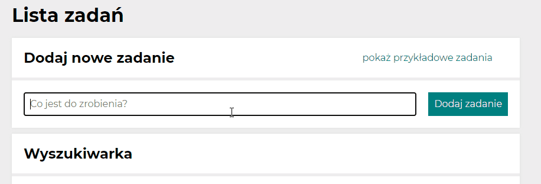
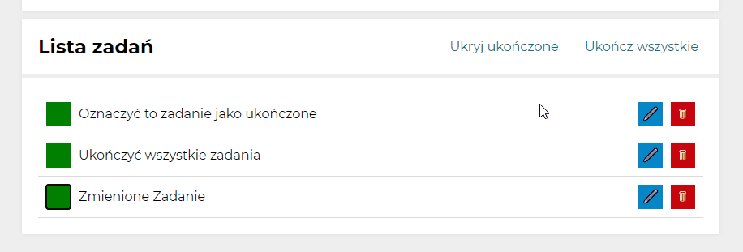
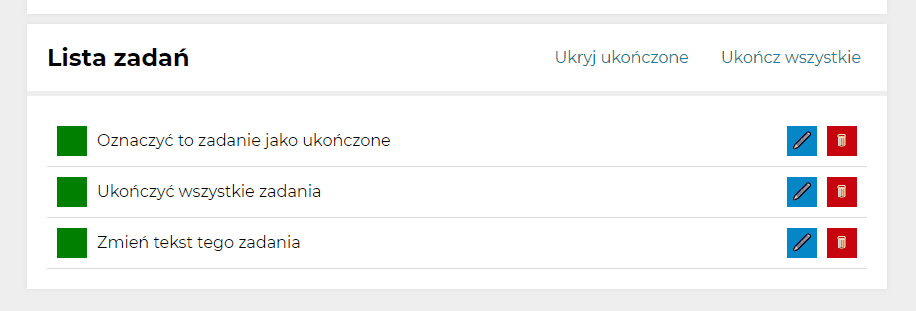
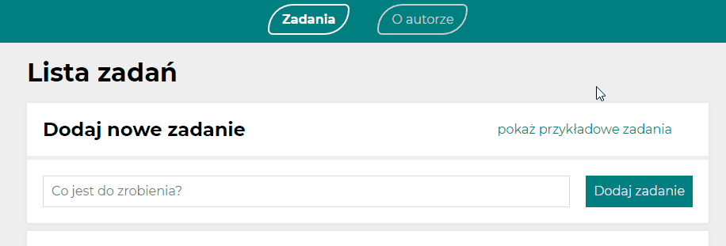
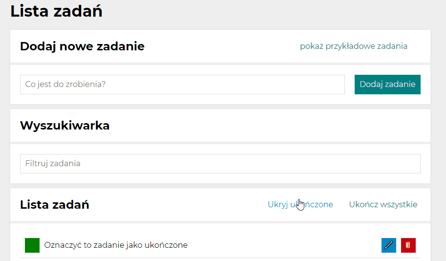
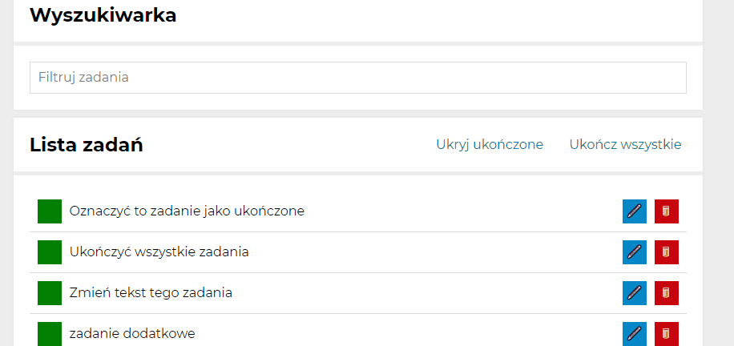
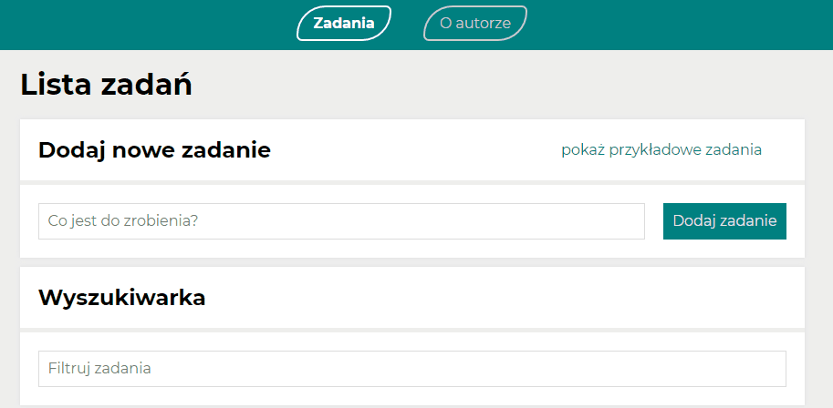
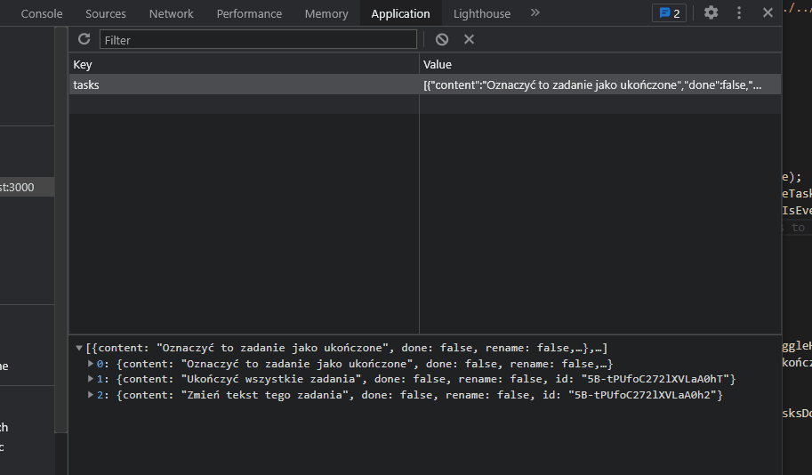

# toDoList

## :computer: Demonstration - link below

[TODOlist Demonstration](https://krzysztof-jaczewski.github.io/toDoList-react/)

## :mag: Instruction

- [General description](#General)
- [Input text](#Input_text)
- [Task list](#Task_list)
- [Finish all tasks button ](#Finish-all-tasks)
- [Used technologies](#Used-Technologies)
- [Scripts](#Available-Scripts)

## :memo: General

Basic to do list, you can add and remove tasks in easy way, aplication works well on browsers and other devices.

## :pencil2: Input text

Input text to frame and click on button to add new taks, after this frame will reser and focus on it Gentle hover effects and transitions on buttons improve user expirience.

## :heavy_check_mark: Task list

Tasks appear in the task list.You can mark completed tasks with green button, then they will be crossed out, or remove them with a red button. looks appropriate with a lot of text even on phones.

Tasks can be hide that are complited or show them with just one click

By clicking this button you can imidietly finish all tasks, and button will be disabled, it will become active again when you add another taks, or mark some task as undone, the buttons will disappear if there are no tasks on list

## :black_nib: Rename task

Additional blue button that can rename single tasks content, this functionality can be used onle on one task at a time

## :slot_machine: Example tasks.

You can load a example tasks into tasks list to try, how it works,
!!!Worning!!!
if you click this button other tasks will be deleted

## :heavy_check_mark: Task page

Every task can be clicked, thet will redirect you to that specify task page, where you can see it`s content and status

## :mag: Search

Tasks can be filtered by the characters that will be displayed in the search engine

## :trophy: Author page

Addictional page that contains some informations about me, feel free to look

## :lock: Local storage

Tasks are storage in localStorage in browser so they don`t disapear even when you refresh page

## :gear: Used Technologies

- HTML
- CSS
- grid
- JavaScript
- BEM
- GIT / githubPages
- Media queries
- React / React Router
- Redux
- Saga
- Axios
- Async/await
- CreatReactApp
- Babel
- WebPack
- JSX
- Hooks / OwnHooks
- ThemeProvider
- JSON
- LocalStorage

## :wrench: Available Scripts

In the project directory, you can run:

### `npm start`

Runs the app in the development mode.\
Open [http://localhost:3000](http://localhost:3000) to view it in the browser.

The page will reload if you make edits.\
You will also see any lint errors in the console.

### `npm run build`

Builds the app for production to the `build` folder.\
It correctly bundles React in production mode and optimizes the build for the best performance.

The build is minified and the filenames include the hashes.\
Your app is ready to be deployed!

See the section about [deployment](https://facebook.github.io/create-react-app/docs/deployment) for more information.

### `npm run eject`

**Note: this is a one-way operation. Once you `eject`, you can’t go back!**

If you aren’t satisfied with the build tool and configuration choices, you can `eject` at any time. This command will remove the single build dependency from your project.

Instead, it will copy all the configuration files and the transitive dependencies (webpack, Babel, ESLint, etc) right into your project so you have full control over them. All of the commands except `eject` will still work, but they will point to the copied scripts so you can tweak them. At this point you’re on your own.

You don’t have to ever use `eject`. The curated feature set is suitable for small and middle deployments, and you shouldn’t feel obligated to use this feature. However we understand that this tool wouldn’t be useful if you couldn’t customize it when you are ready for it.
